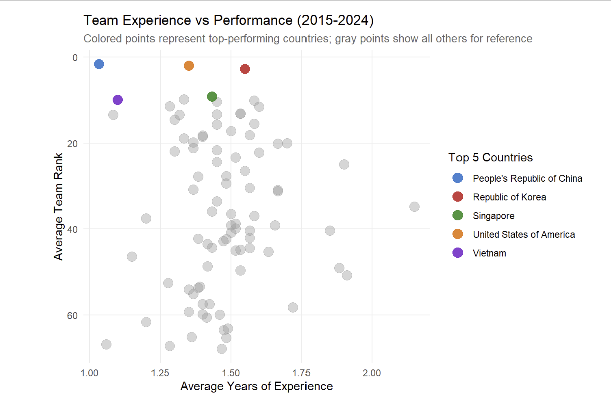

This project analyzes ten years of International Mathematical Olympiad (IMO) data (2015–2024) to identify the key drivers of sustained national performance. Using both country-level and individual-level datasets, the analysis examines trends in team rankings, contestant experience, and problem-specific performance to understand what differentiates consistently top-performing nations.

## Project Overview

The International Mathematical Olympiad (IMO) is the world’s most prestigious mathematics competition for pre-university students. Each country fields a team of six contestants, with national rankings determined by the team’s combined score. While medals are awarded individually, long-term national success depends on collective performance.

This study evaluates whether team experience and problem-specific mastery explain differences in country rankings over time. The results show that average contestant experience has little to no relationship with national performance, whereas strong performance on the most difficult problems (P3 and P6) consistently distinguishes top-ranked countries from the rest. These findings suggest that sustained IMO success is driven less by experience accumulation and more by strategic mastery of high-difficulty problems.

## Sample Visualizations

### Ranking Trends of Top Countries (2015–2024)

### Team Experience vs Ranking

### Problem-Specific Performance

## Key Features

- **Data Wrangling & Cleaning:**  
  - Processed country- and individual-level datasets.  
  - Handled missing values and removed unused columns (e.g., `p7`).  
  - Engineered features such as `total_score`, `cumulative_score`, and contestant experience.  
  - Designed the analysis workflow from raw datasets to insights on top-country performance, including how to identify evaluate the "top5" countries etc.

- **Exploratory Analysis & Visualization:**  
  - **Line Charts:** Tracked yearly ranking trends of top countries.  
  - **Scatter Plots:** Evaluated the effect of average team experience on rankings (no significant correlation found).  
  - **Comparative Bar Charts:** Analyzed problem-specific performance; identified hardest problems (P3 & P6) as key differentiators for top-ranked nations.

- **Statistical Insights:**  
  - Contestant experience alone does not predict national success.  
  - Mastery of the most challenging problems strongly correlates with higher country rankings (i.e the countries that score the highest for the toughest questions will likely rank higher) 

- **Collaboration & Reporting:**  
  - Developed as a team of 5 students.  
  - Shared responsibilities across data cleaning, visualization, analysis, and report synthesis.  
  - Delivered polished visualizations and a coherent report using R Markdown.

## Tech Stack & Skills

- **Languages & Tools:** R, R Markdown, dplyr, ggplot2, tidyverse  
- **Skills Demonstrated:** Data wrangling, feature engineering, statistical analysis, visualization, teamwork, and rmd report writing.

## Dataset

The dataset used in this project was curated by [Havisha Khurana](https://github.com/havishakhurana) for TidyTuesday. It contains information on IMO participants, including country, gender, and scores. The data can be accessed here:

- [IMO Data (TidyTuesday, 2024-09-24)](https://github.com/rfordatascience/tidytuesday/blob/main/data/2024/2024-09-24/readme.md)

